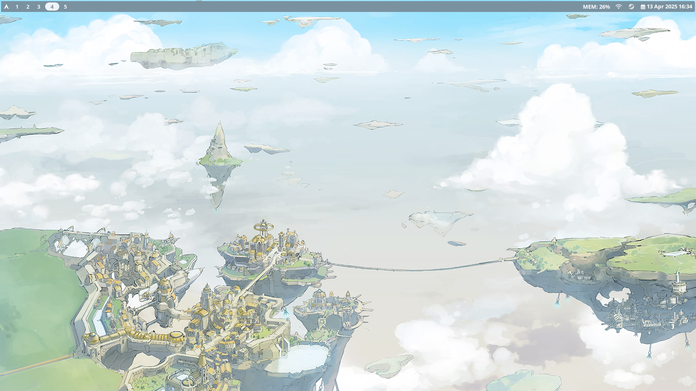
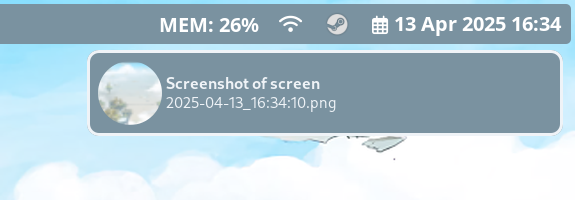
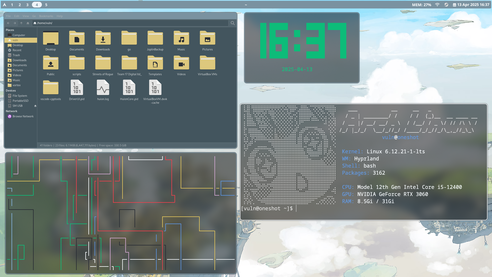
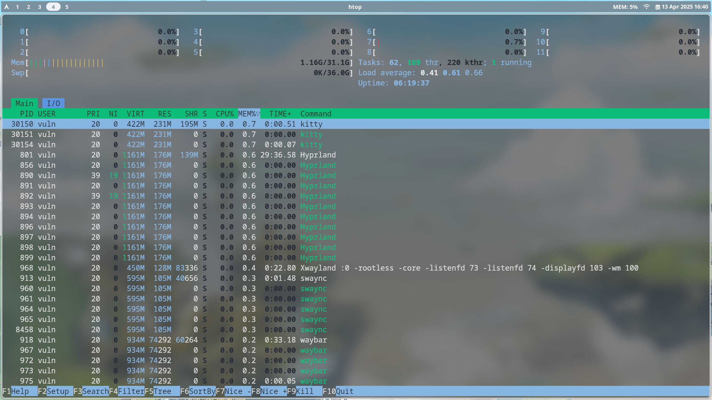
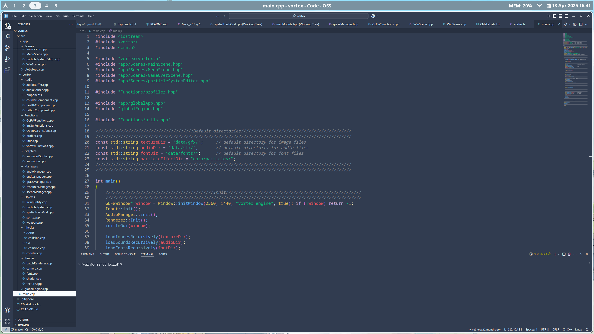
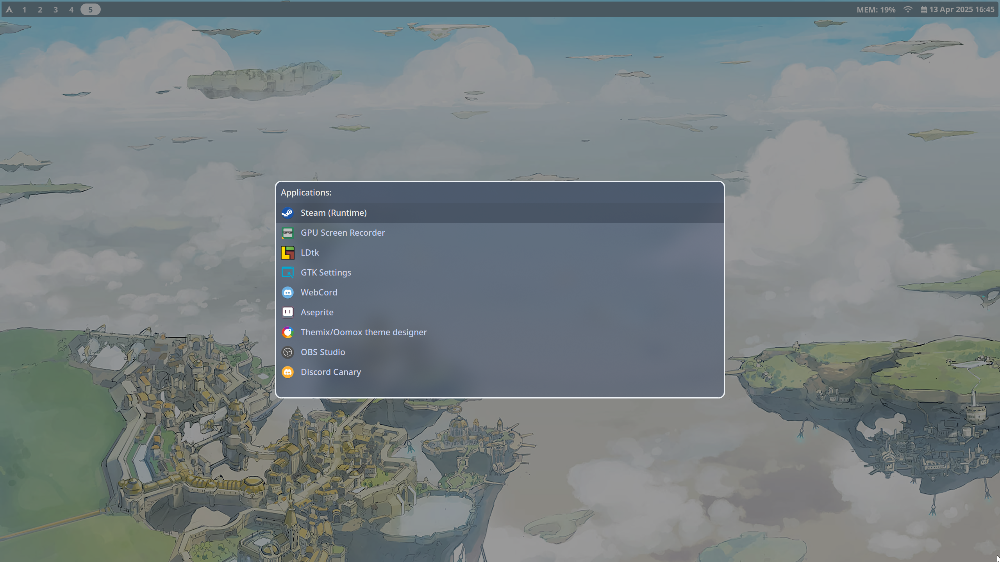
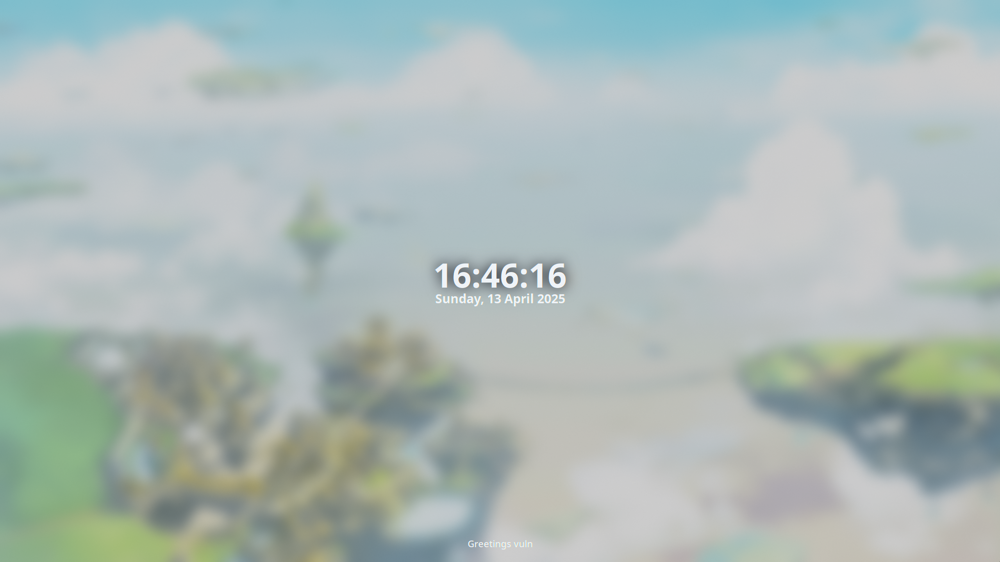

# WorldEnd

My custom rice I daily drive.

It supports both i3wm and hyprland

The name comes from the anime WorldEnd or suka-suka.

---
### Dependencies for hyprland:
- hyprland
- hyprlock
- hypridle
- waybar
- swww
- grim
- grimblast
- swaync
- rofi
- kitty

`yay -Sy hyprland hyprlock hypridle waybar swww grim grimblast swaync rofi kitty`

---
### Dependencies for i3:
- i3
- polybar
- picom
- nitrogen
- dunst
- brightnessctl
- maim
- rofi
- kitty

`yay -Sy i3 polybar picom nitrogen dunst brightnessctl maim rofi kitty`

---
### Some other programms I use:
- thunar (file manager)
- code (code editor)
- brave (browser)
- gpu-screen-recorder (recording and replay cli)
- gpu-screen-recorder-gtk (recording and replay gui)
- gwenview (image viewer)

`yay -Sy thunar code brave-bin gpu-screen-recorder gpu-screen-recorder-gtk gwenview`

---

For the gtk theme, you need to get themix with the papyrus icons addon to create the gtk theme. 

Note: The keyboard layout is set to de (german layout)

### Screenshots

